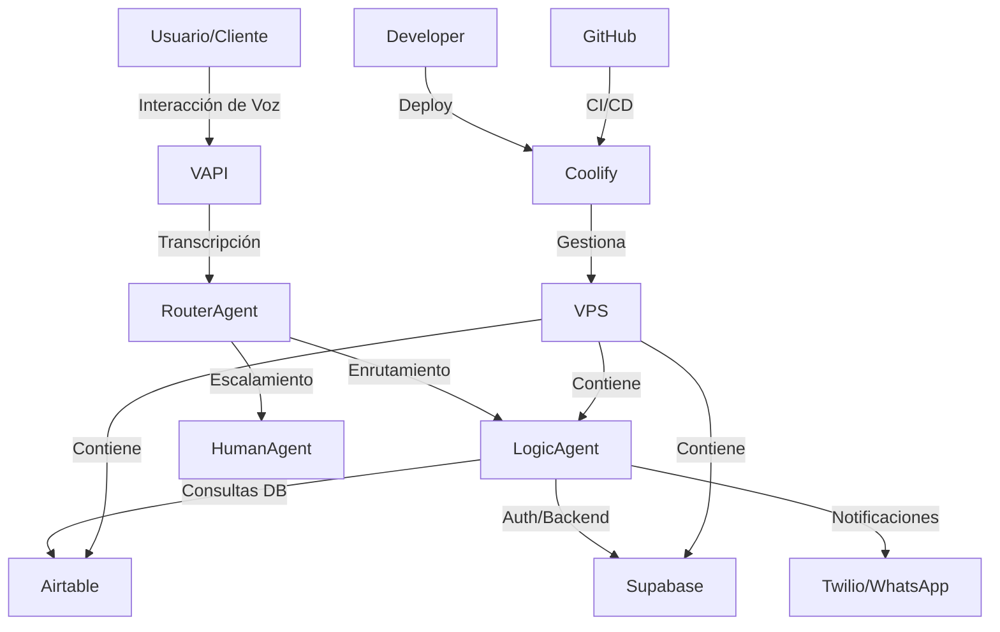
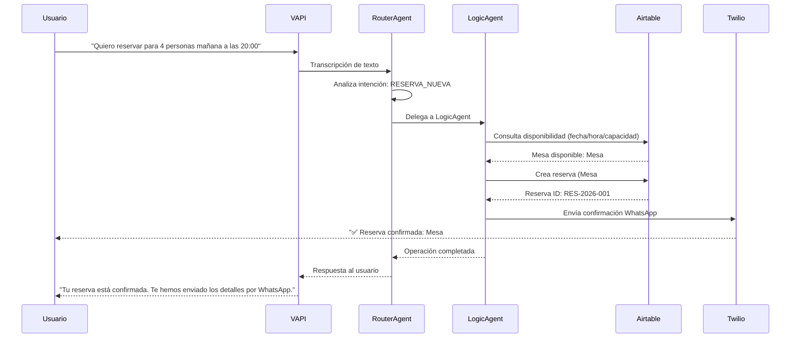
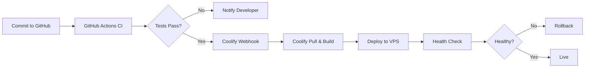

# 🏗️ ARQUITECTURA DEL SISTEMA - En Las Nubes Asistente de Voz

> **Proyecto:** Cerebro En Las Nubes - Asistente de Voz Restobar  
> **Ubicación:** Logroño, España  
> **Fecha:** 2026-02-08  
> **Versión:** 2.0 (Post-migración de seguridad)

---

## 🎯 VISIÓN GENERAL

Sistema multi-agente de asistente de voz para gestión de reservas del restaurante "En Las Nubes Restobar" en Logroño, España.

### Funcionalidades Principales:
- ✅ Reservas por voz (VAPI)
- ✅ Confirmación por WhatsApp (Twilio)
- ✅ Gestión de mesas y disponibilidad (Airtable)
- ✅ Autenticación y backend (Supabase)
- ✅ Deployment automatizado (Coolify)

---

## 🏗️ ARQUITECTURA MULTI-AGENTE



---

## 🤖 AGENTES DEL SISTEMA

### 1. **RouterAgent** (gpt-4o-mini)
**Responsabilidad:** Enrutamiento inteligente de consultas

- Analiza la intención del usuario
- Decide si es consulta simple o compleja
- Escala a LogicAgent o HumanAgent según sea necesario
- Gestiona el contexto de conversación

**Modelo:** `gpt-4o-mini` (rápido, eficiente para enrutamiento)

---

### 2. **LogicAgent** (deepseek-chat)
**Responsabilidad:** Lógica de negocio y operaciones

- Valida disponibilidad de mesas
- Procesa reservas completas
- Consulta/actualiza base de datos (Airtable)
- Envía confirmaciones por WhatsApp (Twilio)
- Maneja reglas de negocio del restaurante

**Modelo:** `deepseek-chat` (costo-efectivo para lógica compleja)

**Reglas de Negocio:**
- Horarios: Almuerzo (12:00-16:00), Cena (20:00-00:00)
- Capacidad: X mesas (ver Airtable para configuración actual)
- Anticipación mínima: 2 horas
- Política de cancelación: X horas antes (verificar en NotebookLM)

---

### 3. **HumanAgent** (gpt-4o)
**Responsabilidad:** Handoff a humano en casos complejos

- Solicitudes especiales (eventos, grupos grandes)
- Quejas o problemas que requieren empatía
- Situaciones ambiguas que necesitan juicio humano
- Transferencia a personal del restaurante

**Modelo:** `gpt-4o` (alta calidad para interacción humana)

---

## 🔗 INTEGRACIONES CRÍTICAS

### 🎙️ **VAPI** (Sistema de Voz) - CRÍTICO
**Función:** Motor de voz del asistente

- Convierte voz a texto (STT)
- Convierte texto a voz (TTS)
- Gestiona flujo de conversación
- Integración con agentes mediante API

**Configuración:**
- Archivo: `run-vapi-mcp.cmd`
- No requiere credenciales (autenticación local)
- MCP Server habilitado

**Endpoints:**
- (Documentar endpoints VAPI si están disponibles)

---

### 📊 **Airtable** (Base de Datos) - CRÍTICO
**Función:** Base de datos principal de reservas

**Tablas:**
- `Reservas`: Registro de todas las reservas
- `Mesas`: Configuración de mesas y capacidades
- `Clientes`: Información de clientes recurrentes
- `Disponibilidad`: Slots de tiempo disponibles

**Credenciales:**
- Variable: `AIRTABLE_API_KEY`
- Scopes: `data.records:read`, `data.records:write`, `schema.bases:read`
- Regenerar: https://airtable.com/create/tokens

**Base ID:** `appcUoRqLVqxQm7K2` (verificar)

---

### 📱 **Twilio** (WhatsApp/SMS) - CRÍTICO
**Función:** Notificaciones y confirmaciones

**Uso:**
- Confirmación de reserva por WhatsApp
- Recordatorios automáticos (X horas antes)
- Notificaciones de cancelación
- Alertas al personal del restaurante

**Credenciales:**
- `TWILIO_ACCOUNT_SID`
- `TWILIO_AUTH_TOKEN`
- `TWILIO_FROM_NUMBER`: +358454910405

**Flujo:**
1. LogicAgent crea reserva en Airtable
2. LogicAgent envía confirmación vía Twilio
3. Cliente recibe WhatsApp con detalles

---

### 🗄️ **Supabase** (Backend/Auth) - CRÍTICO
**Función:** Backend secundario y autenticación

**Uso:**
- Autenticación de usuarios (si aplica)
- Storage de archivos (menús, imágenes)
- Logs y analytics
- Base de datos PostgreSQL complementaria

**Credenciales:**
- `SUPABASE_URL`: https://supabasekong-bo4cc0k0swg0c08k40ockog8.app.generaia.site/mcp
- `SUPABASE_ACCESS_TOKEN`

---

### ☁️ **Coolify** (Deployment) - CRÍTICO
**Función:** Gestión de infraestructura VPS

**Uso:**
- Deploy automático de código
- Gestión de contenedores Docker
- Logs y monitoreo
- Configuración de entorno

**Credenciales:**
- `COOLIFY_API_URL`: https://coolify.generaia.site
- `COOLIFY_API_TOKEN` (versión 14)

**Servicios Deployados:**
- Sistema multi-agente (RouterAgent, LogicAgent, HumanAgent)
- APIs de integración (Airtable, Twilio, Supabase)
- Sistema de caché (Redis - opcional)

---

### 🐙 **GitHub** (Control de Versiones)
**Función:** Repositorio de código

**Uso:**
- Control de versiones
- CI/CD pipeline
- Documentación técnica
- Issues y tracking

**Credenciales:**
- `GITHUB_PERSONAL_ACCESS_TOKEN`

---

### 📚 **NotebookLM** (Fuente de Verdad de Negocio)
**Función:** Documentación de reglas de negocio

**Uso:**
- Políticas del restaurante
- Horarios especiales
- Menús y precios
- Procedimientos operativos

**Configuración:**
- Autenticación manual vía OAuth
- MCP Server habilitado
- Prioridad: NotebookLM > Código (para conflictos)

---

## 🔐 SEGURIDAD

### Variables de Entorno Permanentes

**Ubicación:** Variables de entorno de usuario de Windows  
**Cargadas automáticamente:** Sí (después de reiniciar Verdent)

**Variables Críticas:**
```
GITHUB_PERSONAL_ACCESS_TOKEN=ghp_***
COOLIFY_API_URL=https://coolify.generaia.site
COOLIFY_API_TOKEN=14|***
TWILIO_ACCOUNT_SID=ACd370***
TWILIO_AUTH_TOKEN=730d87***
TWILIO_FROM_NUMBER=+358454910405
AIRTABLE_API_KEY=patAif9***
SUPABASE_URL=https://supabasekong-bo4cc0k0swg0c08k40ockog8.app.generaia.site/mcp
SUPABASE_ACCESS_TOKEN=eyJ0eX***
```

**Archivo Local (NO commitear):**
- `.env.mcp` - Contiene todos los secrets
- Protegido por `.gitignore`

---

## 🚀 FLUJO COMPLETO DE RESERVA



---

## 🛠️ FLUJO DE DEPLOYMENT



---

## 📊 STACK TECNOLÓGICO

### Backend
- **Lenguaje:** Python (FastAPI) / Node.js (verificar)
- **Framework:** FastAPI / Express
- **ORM:** SQLAlchemy / Prisma
- **Testing:** pytest / Jest

### Frontend (si aplica)
- **Framework:** React / Next.js (verificar si existe UI de admin)
- **Styling:** Tailwind CSS
- **State Management:** Zustand / Redux

### Infraestructura
- **Hosting:** VPS (gestionado por Coolify)
- **Containerización:** Docker
- **Orchestration:** Coolify
- **CI/CD:** GitHub Actions

### Base de Datos
- **Principal:** Airtable (NoSQL/Relacional híbrido)
- **Secundaria:** Supabase PostgreSQL
- **Caché:** Redis (opcional)

---

## 🔍 OBSERVABILIDAD

### Logs
- **Ubicación:** Coolify Logs Dashboard
- **Formato:** JSON estructurado (verificar)
- **Retention:** X días (configurar)

### Métricas
- **Tool:** (Verificar si hay Grafana/Prometheus)
- **Dashboards:** (A implementar)

### Alertas
- **Canal:** (Email/Slack - configurar)
- **Condiciones:** (Errores críticos, downtime)

---

## 🚧 ÁREAS DE MEJORA IDENTIFICADAS

### 1. Observabilidad (FASE 4)
- [ ] Implementar logging estructurado
- [ ] Configurar métricas de negocio (reservas/día, tasa de éxito)
- [ ] Dashboards en tiempo real
- [ ] Alertas proactivas

### 2. Optimización (FASE 5)
- [ ] Redis connection pooling
- [ ] Airtable query optimization
- [ ] Rate limiting en APIs
- [ ] Circuit breaker para resiliencia

### 3. Testing
- [ ] Tests unitarios (coverage > 80%)
- [ ] Tests de integración para flujo completo
- [ ] Tests de carga (simular picos de demanda)
- [ ] Contract tests con Airtable/Twilio

### 4. Documentación
- [ ] API documentation (OpenAPI/Swagger)
- [ ] Runbooks para incidentes
- [ ] Onboarding para nuevos developers
- [ ] Diagramas actualizados en tiempo real

---

## 📞 CONTACTOS Y RECURSOS

### URLs Críticas
- **Coolify Dashboard:** https://coolify.generaia.site
- **Airtable Base:** https://airtable.com/appcUoRqLVqxQm7K2 (verificar ID)
- **Supabase Dashboard:** https://supabasekong-bo4cc0k0swg0c08k40ockog8.app.generaia.site
- **GitHub Repo:** (URL del repositorio)

### Regeneración de Tokens
- **GitHub:** https://github.com/settings/tokens
- **Airtable:** https://airtable.com/create/tokens
- **Coolify:** https://coolify.generaia.site/security/api-tokens

---

## 📝 NOTAS IMPORTANTES

1. **NotebookLM es la fuente de verdad** para reglas de negocio
2. **n8n NO se usa** en este proyecto (deshabilitado)
3. **VAPI es CRÍTICO** para el funcionamiento del asistente de voz
4. **Todas las reservas deben confirmarse por WhatsApp**
5. **LogicAgent usa deepseek-chat** para optimizar costos

---

**Última actualización:** 2026-02-08  
**Mantenido por:** Verdent AI + Equipo de Desarrollo  
**Próxima revisión:** Después de FASE 4 (Auditoría Arquitectónica)
