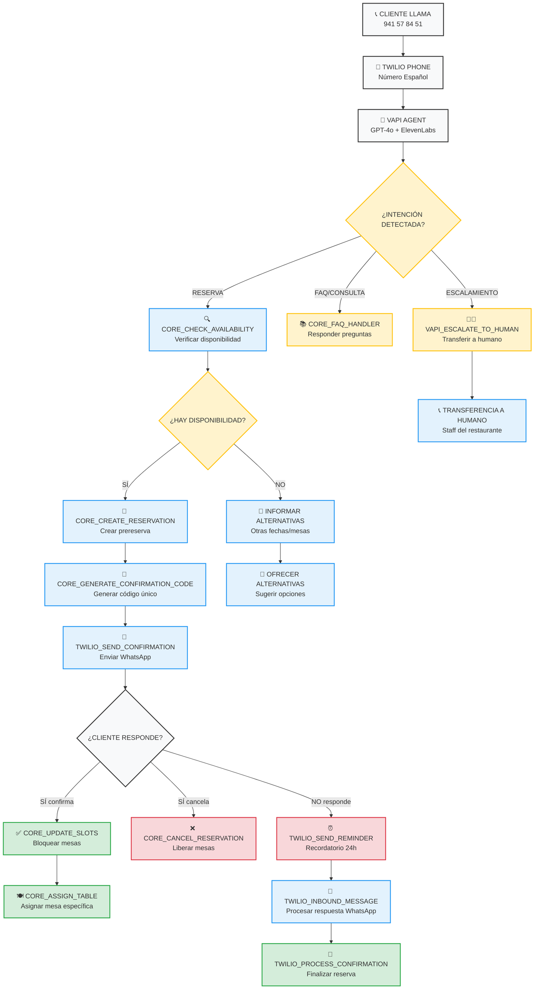

# 🏛️ ARQUITECTURA COMPLETA - SISTEMA DE RESERVAS "EN LAS NUBES RESTOBAR"

## 📋 ÍNDICE

1. [Visión General del Sistema](#visión-general)
2. [Arquitectura de Componentes](#arquitectura-de-componentes)
3. [Diagrama de Flujo Completo](#diagrama-de-flujo-completo)
4. [Modelo de Datos PostgreSQL](#modelo-de-datos-postgresql)
5. [Matriz de Asignación de Mesas](#matriz-de-asignación-de-mesas)
6. [Flujo de Trabajo Completo](#flujo-de-trabajo-completo)
7. [Especificaciones Técnicas](#especificaciones-técnicas)
8. [Consideraciones de Escalabilidad](#consideraciones-de-escalabilidad)

---

<a name="visión-general"></a>
## 🎯 VISIÓN GENERAL DEL SISTEMA

El sistema de reservas para "En Las Nubes Restobar" está diseñado como una solución integral que automatiza completamente el proceso de reservas telefónicas, desde la llamada inicial hasta la confirmación por WhatsApp.

### Principios de Diseño
- **Voz como entrada principal**: Las llamadas telefónicas son el canal prioritario de entrada
- **WhatsApp para confirmaciones**: Canal principal de comunicación con clientes
- **Automatización inteligente**: Uso de IA para clasificación y procesamiento
- **Datos centralizados**: PostgreSQL como única fuente de verdad
- **Workflows modulares**: n8n para orquestación de procesos
- **Escalabilidad**: Diseñado para multitenant futuro

### Actores del Sistema
1. **Cliente**: Realiza llamadas telefónicas y recibe confirmaciones
2. **VAPI Agent**: Agente de IA que procesa llamadas y coordina workflows
3. **n8n Workflows**: Motor de automatización que ejecuta la lógica de negocio
4. **PostgreSQL**: Base de datos centralizada
5. **Twilio**: Proveedor de telefonía y WhatsApp
6. **Staff del Restaurante**: Recibe notificaciones y gestiona mesas

---

<a name="arquitectura-de-componentes"></a>
## 🏗️ ARQUITECTURA DE COMPONENTES

### 1. Capa de Entrada (Telefonía)

#### VAPI Integration Layer
```
┌─────────────────────────────────────────┐
│           VAPI AGENT              │
│  ┌─────────────────────────────┐    │
│  │ GPT-4o (Razonamiento)   │    │
│  │ ElevenLabs (Voz ES-ES)  │    │
│  │ System Prompt + Tools     │    │
│  └─────────────────────────────┘    │
│  ┌─────────────────────────────┐    │
│  │ Twilio Integration         │    │
│  │ - Número Español         │    │
│  │ - Voice API              │    │
│  │ - WhatsApp Forwarding     │    │
│  └─────────────────────────────┘    │
└─────────────────────────────────────────┘
```

**Componentes VAPI:**
- **GPT-4o**: Motor de razonamiento principal
- **ElevenLabs**: Síntesis de voz en español neutro
- **System Prompt**: Instrucciones de negocio y manejo de casos
- **Tools**: Function calling para integración con n8n
- **Twilio Bridge**: Conexión telefónica y WhatsApp

### 2. Capa de Orquestación (n8n)

#### Core Workflows (Grupo A)
```
┌─────────────────────────────────────────────────────────────────────────────────────────────────┐
│                           n8n WORKFLOW ENGINE                             │
│                                                                          │
│  ┌─────────────────────────────────────────────────────────────────────────────┐      │
│  │                    CORE WORKFLOWS (5)                        │      │
│  │  ┌─────────────────────────────────────────────────────────────┐    │      │
│  │  │ CORE_CHECK_AVAILABILITY                            │    │      │
│  │  │ - Input: {fecha, hora, personas}              │    │      │
│  │  │ - Logic: Query PostgreSQL + Rules Engine       │    │      │
│  │  │ - Output: {disponible, mesas, turno}        │    │      │
│  │  └─────────────────────────────────────────────────────────────┘    │      │
│  │  ┌─────────────────────────────────────────────────────────────┐    │      │
│  │  │ CORE_CREATE_RESERVATION                         │    │      │
│  │  │ - Input: Datos cliente + preferencias          │    │      │
│  │  │ - Logic: Create record + Block slots          │    │      │
│  │  │ - Output: {reserva_id, estado}              │    │      │
│  │  └─────────────────────────────────────────────────────────────┘    │      │
│  │  ┌─────────────────────────────────────────────────────────────┐    │      │
│  │  │ CORE_UPDATE_SLOTS                              │    │      │
│  │  │ - Input: {reserva_id, action}                 │    │      │
│  │  │ - Logic: Update availability table              │    │      │
│  │  │ - Output: {success, slots_actualizados}         │    │      │
│  │  └─────────────────────────────────────────────────────────────┘    │      │
│  │  ┌─────────────────────────────────────────────────────────────┐    │      │
│  │  │ CORE_GENERATE_CONFIRMATION_CODE                  │    │      │
│  │  │ - Input: {reserva_id}                          │    │      │
│  │  │ - Logic: Generate unique code + Send WhatsApp      │    │      │
│  │  │ - Output: {codigo, enviado}                    │    │      │
│  │  └─────────────────────────────────────────────────────────────┘    │      │
│  │  ┌─────────────────────────────────────────────────────────────┐    │      │
│  │  │ CORE_ASSIGN_TABLE                              │    │      │
│  │  │ - Input: {reserva_id, mesa_id}               │    │      │
│  │  │ - Logic: Update reservation + table assignment   │    │      │
│  │  │ - Output: {asignacion_confirmada}             │    │      │
│  │  └─────────────────────────────────────────────────────────────┘    │      │
│  └─────────────────────────────────────────────────────────────────────────────┘      │
│                                                                          │
│  ┌─────────────────────────────────────────────────────────────────────────────┐      │
│  │                   VAPI WORKFLOWS (5)                          │      │
│  │  ┌─────────────────────────────────────────────────────────────┐    │      │
│  │  │ VAPI_INBOUND_CALL                              │    │      │
│  │  │ - Trigger: Incoming call from Twilio              │    │      │
│  │  │ - Logic: Route to VAPI for processing           │    │      │
│  │  │ - Output: VAPI session initiated                 │    │      │
│  │  └─────────────────────────────────────────────────────────────┘    │      │
│  │  ┌─────────────────────────────────────────────────────────────┐    │      │
│  │  │ VAPI_CLASSIFY_INTENT                           │    │      │
│  │  │ - Input: Call transcript + context               │    │      │
│  │  │ - Logic: GPT-4o classification                 │    │      │
│  │  │ - Output: {intent, entities, confidence}        │    │      │
│  │  └─────────────────────────────────────────────────────────────┘    │      │
│  │  ┌─────────────────────────────────────────────────────────────┐    │      │
│  │  │ VAPI_RESERVATION_FLOW                         │    │      │
│  │  │ - Input: Reservation intent + data              │    │      │
│  │  │ - Logic: Call n8n tools sequentially           │    │      │
│  │  │ - Output: Reservation created/updated            │    │      │
│  │  └─────────────────────────────────────────────────────────────┘    │      │
│  │  ┌─────────────────────────────────────────────────────────────┐    │      │
│  │  │ VAPI_FAQ_HANDLER                               │    │      │
│  │  │ - Input: FAQ intent                             │    │      │
│  │  │ - Logic: Query knowledge base or n8n           │    │      │
│  │  │ - Output: Answer to customer                   │    │      │
│  │  └─────────────────────────────────────────────────────────────┘    │      │
│  │  ┌─────────────────────────────────────────────────────────────┐    │      │
│  │  │ VAPI_ESCALATE_TO_HUMAN                         │    │      │
│  │  │ - Input: Complex request or escalation           │    │      │
│  │  │ - Logic: Notify staff + transfer call           │    │      │
│  │  │ - Output: Human agent notified                 │    │      │
│  │  └─────────────────────────────────────────────────────────────┘    │      │
│  └─────────────────────────────────────────────────────────────────────────────┘      │
│                                                                          │
│  ┌─────────────────────────────────────────────────────────────────────────────┐      │
│  │                 WHATSAPP WORKFLOWS (4)                        │      │
│  │  ┌─────────────────────────────────────────────────────────────┐    │      │
│  │  │ TWILIO_SEND_CONFIRMATION                      │    │      │
│  │  │ - Trigger: New reservation created              │    │      │
│  │  │ - Logic: Format message + Send via Twilio      │    │      │
│  │  │ - Output: Confirmation sent to customer         │    │      │
│  │  └─────────────────────────────────────────────────────────────┘    │      │
│  │  ┌─────────────────────────────────────────────────────────────┐    │      │
│  │  │ TWILIO_SEND_REMINDER                         │    │      │
│  │  │ - Trigger: 24h before reservation time         │    │      │
│  │  │ - Logic: Format reminder + Send WhatsApp       │    │      │
│  │  │ - Output: Reminder sent to customer            │    │      │
│  │  └─────────────────────────────────────────────────────────────┘    │      │
│  │  ┌─────────────────────────────────────────────────────────────┐    │      │
│  │  │ TWILIO_INBOUND_MESSAGE                         │    │      │
│  │  │ - Trigger: WhatsApp message from customer        │    │      │
│  │  │ - Logic: Parse response + Update reservation   │    │      │
│  │  │ - Output: Reservation status updated          │    │      │
│  │  └─────────────────────────────────────────────────────────────┘    │      │
│  │  ┌─────────────────────────────────────────────────────────────┐    │      │
│  │  │ TWILIO_PROCESS_CONFIRMATION                   │    │      │
│  │  │ - Trigger: Confirmation response received        │    │      │
│  │  │ - Logic: Validate + Finalize reservation      │    │      │
│  │  │ - Output: Reservation confirmed               │    │      │
│  │  └─────────────────────────────────────────────────────────────┘    │      │
│  └─────────────────────────────────────────────────────────────────────────────┘      │
│                                                                          │
│  ┌─────────────────────────────────────────────────────────────────────────────┐      │
│  │                 WEATHER WORKFLOW (1)                             │      │
│  │  ┌─────────────────────────────────────────────────────────────┐    │      │
│  │  │ WEATHER_CHECK_TERRACE                        │    │      │
│  │  │ - Trigger: Terrace preference detected           │    │      │
│  │  │ - Logic: Check weather API + Advise          │    │      │
│  │  │ - Output: Weather recommendation sent        │    │      │
│  │  └─────────────────────────────────────────────────────────────┘    │      │
│  └─────────────────────────────────────────────────────────────────────────────┘      │
└─────────────────────────────────────────────────────────────────────────────────────────────┘
```

### 3. Capa de Datos (PostgreSQL)

#### Base de Datos Centralizada
```
┌─────────────────────────────────────────────────────────────────────────────────────────┐
│                        POSTGRESQL DATABASE                              │
│                                                                          │
│  ┌─────────────────────────────────────────────────────────────────────┐      │
│  │                    TABLES (5)                             │      │
│  │  ┌─────────────────────────────────────────────────────┐    │      │
│  │  │ restaurants                                     │    │      │
│  │  │ - restaurant_id (PK)                           │    │      │
│  │  │ - name, address, phone, hours                   │    │      │
│  │  │ - config: turnos, mesas, restricciones        │    │      │
│  │  └─────────────────────────────────────────────────────┘    │      │
│  │  ┌─────────────────────────────────────────────────────┐    │      │
│  │  │ tables                                         │    │      │
│  │  │ - table_id (PK)                               │    │      │
│  │  │ - restaurant_id (FK)                            │    │      │
│  │  │ - number, capacity, zone, type                  │    │      │
│  │  │ - coordinates_x, coordinates_y                   │    │      │
│  │  └─────────────────────────────────────────────────────┘    │      │
│  │  ┌─────────────────────────────────────────────────────┐    │      │
│  │  │ reservations                                   │    │      │
│  │  │ - reservation_id (PK)                         │    │      │
│  │  │ - customer_data, restaurant_id, table_id           │    │      │
│  │  │ - fecha, hora, personas, estado                 │    │      │
│  │  │ - turno, special_requests                     │    │      │
│  │  └─────────────────────────────────────────────────────┘    │      │
│  │  ┌─────────────────────────────────────────────────────┐    │      │
│  │  │ availability_slots                             │    │      │
│  │  │ - slot_id (PK)                                │    │      │
│  │  │ - table_id, fecha, hora, estado                │    │      │
│  │  │ - reservation_id (FK, nullable)               │    │      │
│  │  └─────────────────────────────────────────────────────┘    │      │
│  │  ┌─────────────────────────────────────────────────────┐    │      │
│  │  │ customers                                     │    │      │
│  │  │ - customer_id (PK)                            │    │      │
│  │  │ - name, phone, whatsapp, preferences            │    │      │
│  │  │ - reservation_history, loyalty_points            │    │      │
│  │  └─────────────────────────────────────────────────────┘    │      │
│  │  ┌─────────────────────────────────────────────────────┐    │      │
│  │  │ audit_log                                     │    │      │
│  │  │ - log_id (PK)                                │    │      │
│  │  │ - timestamp, action, entity_id, entity_type       │    │      │
│  │  │ - details, user_id, ip_address               │    │      │
│  │  └─────────────────────────────────────────────────────┘    │      │
│  └─────────────────────────────────────────────────────────────────────┘      │
│                                                                          │
│  ┌─────────────────────────────────────────────────────────────────────┐      │
│  │                 INDEXES & PERFORMANCE                      │      │
│  │  - Primary keys en todas las tablas                   │      │
│  │  - Foreign keys con constraints                     │      │
│  │  - Índices en fechas y horas críticas           │      │
│  │  - Partitioning por fecha si es necesario            │      │
│  └─────────────────────────────────────────────────────────────────────┘      │
└─────────────────────────────────────────────────────────────────────────────────────────┘
```

---

<a name="diagrama-de-flujo-completo"></a>
## 🔄 DIAGRAMA DE FLUJO COMPLETO

### Flujo End-to-End: Desde Llamada hasta Confirmación



### Flujo de Datos entre Componentes

```
┌─────────────────────────────────────────────────────────────────────────────────────────────────┐
│                           FLUJO DE DATOS COMPLETO                        │
│                                                                          │
│  CLIENTE → TWILIO → VAPI → n8n → POSTGRESQL → TWILIO → CLIENTE       │
│                                                                          │
│  ┌─────────────────────────────────────────────────────────────────────┐      │
│  │              1. CAPTURA DE ENTRADA                   │      │
│  │  ┌─────────────────────────────────────────────────────┐    │      │
│  │  │ Llamada telefónica entrante                │    │      │
│  │  │ Twilio recibe y transfiere a VAPI          │    │      │
│  │  │ VAPI transcribe y clasifica con GPT-4o     │    │      │
│  │  └─────────────────────────────────────────────────────┘    │      │
│  └─────────────────────────────────────────────────────────────────────┘      │
│                                                                          │
│  ┌─────────────────────────────────────────────────────────────────────┐      │
│  │              2. PROCESAMIENTO INTELIGENTE            │      │
│  │  ┌─────────────────────────────────────────────────────┐    │      │
│  │  │ Clasificación de intención                  │    │      │
│  │  │ Extracción de entidades                   │    │      │
│  │  │ Validación de reglas de negocio           │    │      │
│  │  │ Consulta a disponibilidad en tiempo real     │    │      │
│  │  └─────────────────────────────────────────────────────┘    │      │
│  └─────────────────────────────────────────────────────────────────────┘      │
│                                                                          │
│  ┌─────────────────────────────────────────────────────────────────────┐      │
│  │              3. GESTIÓN DE DATOS                     │      │
│  │  ┌─────────────────────────────────────────────────────┐    │      │
│  │  │ Creación/actualización de registros        │    │      │
│  │  │ Bloqueo de slots de disponibilidad       │    │      │
│  │  │ Asignación de mesas específicas          │    │      │
│  │  │ Logging completo de auditoría            │    │      │
│  │  └─────────────────────────────────────────────────────┘    │      │
│  └─────────────────────────────────────────────────────────────────────┘      │
│                                                                          │
│  ┌─────────────────────────────────────────────────────────────────────┐      │
│  │              4. COMUNICACIÓN SALIENTE                  │      │
│  │  ┌─────────────────────────────────────────────────────┐    │      │
│  │  │ Generación de códigos de confirmación   │    │      │
│  │  │ Envío de mensajes por WhatsApp            │    │      │
│  │  │ Recordatorios automáticos                 │    │      │
│  │  │ Notificaciones al staff                  │    │      │
│  │  └─────────────────────────────────────────────────────┘    │      │
│  └─────────────────────────────────────────────────────────────────────┘      │
└─────────────────────────────────────────────────────────────────────────────────────────────┘
```

---

<a name="modelo-de-datos-postgresql"></a>
## 🗄️ MODELO DE DATOS POSTGRESQL

### Estructura Completa de Tablas

#### 1. Tabla: restaurants
```sql
CREATE TABLE restaurants (
    restaurant_id UUID PRIMARY KEY DEFAULT gen_random_uuid(),
    name VARCHAR(100) NOT NULL,
    address TEXT NOT NULL,
    phone VARCHAR(20) NOT NULL,
    email VARCHAR(100),
    capacity_total INTEGER NOT NULL DEFAULT 123,
    
    -- Configuración de horarios
    hours_config JSONB NOT NULL DEFAULT '{
        "lunes_vespertino": {"inicio": "19:30", "fin": "23:00"},
        "martes_vespertino": {"inicio": "19:30", "fin": "23:00"},
        "miercoles_vespertino": {"inicio": "19:30", "fin": "23:00"},
        "jueves_vespertino": {"inicio": "19:30", "fin": "23:00"},
        "viernes_vespertino": {"inicio": "19:30", "fin": "23:00"},
        "sabado_completo": {"inicio": "12:30", "fin": "16:00"},
        "domingo_completo": {"inicio": "12:30", "fin": "16:00"}
    }',
    
    -- Configuración de turnos
    turn_config JSONB NOT NULL DEFAULT '{
        "almuerzo": {"duracion": 90, "ultimo_turno": "14:00"},
        "cena": {"duracion": 120, "ultimo_turno": "22:00"}
    }',
    
    -- Configuración de restricciones
    restrictions JSONB NOT NULL DEFAULT '{
        "mesas_especiales": ["C2", "C3"],
        "politica_mascotas": "no_permitidas",
        "opciones_sin_gluten": true,
        "tiempo_cancelacion": 24,
        "tiempo_confirmacion": 2
    }',
    
    created_at TIMESTAMP WITH TIME ZONE DEFAULT CURRENT_TIMESTAMP,
    updated_at TIMESTAMP WITH TIME ZONE DEFAULT CURRENT_TIMESTAMP
);

-- Índices
CREATE INDEX idx_restaurants_name ON restaurants(name);
CREATE INDEX idx_restaurants_active ON restaurants(created_at);
```

#### 2. Tabla: tables
```sql
CREATE TABLE tables (
    table_id UUID PRIMARY KEY DEFAULT gen_random_uuid(),
    restaurant_id UUID NOT NULL REFERENCES restaurants(restaurant_id),
    table_number VARCHAR(10) NOT NULL,
    capacity INTEGER NOT NULL CHECK (capacity > 0),
    zone VARCHAR(20) NOT NULL CHECK (zone IN ('interior', 'terraza', 'barra', 'privado')),
    table_type VARCHAR(20) NOT NULL CHECK (table_type IN ('estandar', 'alta', 'baja', 'especial', 'compartida')),
    
    -- Coordenadas para asignación inteligente
    coordinates_x DECIMAL(8,2),
    coordinates_y DECIMAL(8,2),
    
    -- Configuración específica
    features JSONB DEFAULT '{
        "sillas_nino": 0,
        "accesibilidad_ruedas": false,
        "cerca_ventana": false,
        "preferencia_grupos": false
    }',
    
    is_active BOOLEAN DEFAULT true,
    created_at TIMESTAMP WITH TIME ZONE DEFAULT CURRENT_TIMESTAMP,
    updated_at TIMESTAMP WITH TIME ZONE DEFAULT CURRENT_TIMESTAMP,
    
    CONSTRAINT unique_restaurant_table UNIQUE(restaurant_id, table_number)
);

-- Índices
CREATE INDEX idx_tables_restaurant ON tables(restaurant_id);
CREATE INDEX idx_tables_zone_capacity ON tables(zone, capacity);
CREATE INDEX idx_tables_active ON tables(is_active);
```

#### 3. Tabla: customers
```sql
CREATE TABLE customers (
    customer_id UUID PRIMARY KEY DEFAULT gen_random_uuid(),
    name VARCHAR(100) NOT NULL,
    phone VARCHAR(20) NOT NULL,
    whatsapp VARCHAR(20),
    email VARCHAR(100),
    
    -- Preferencias del cliente
    preferences JSONB DEFAULT '{
        "zona_preferida": null,
        "mesa_preferida": null,
        "alergias": [],
        "ocasiones_especiales": [],
        "frecuencia_visita": "ocasional",
        "notificaciones_recordatorios": true
    }',
    
    -- Historial y lealtad
    total_reservations INTEGER DEFAULT 0,
    loyalty_points INTEGER DEFAULT 0,
    last_visit_date DATE,
    
    -- GDPR
    data_consent BOOLEAN DEFAULT false,
    consent_date TIMESTAMP WITH TIME ZONE,
    
    created_at TIMESTAMP WITH TIME ZONE DEFAULT CURRENT_TIMESTAMP,
    updated_at TIMESTAMP WITH TIME ZONE DEFAULT CURRENT_TIMESTAMP,
    
    CONSTRAINT unique_customer_phone UNIQUE(phone)
);

-- Índices
CREATE INDEX idx_customers_phone ON customers(phone);
CREATE INDEX idx_customers_name ON customers(name);
CREATE INDEX idx_customers_whatsapp ON customers(whatsapp);
```

#### 4. Tabla: reservations
```sql
CREATE TABLE reservations (
    reservation_id UUID PRIMARY KEY DEFAULT gen_random_uuid(),
    customer_id UUID REFERENCES customers(customer_id),
    restaurant_id UUID NOT NULL REFERENCES restaurants(restaurant_id),
    table_id UUID REFERENCES tables(table_id),
    
    -- Datos de la reserva
    reservation_date DATE NOT NULL,
    reservation_time TIME NOT NULL,
    num_personas INTEGER NOT NULL CHECK (num_personas > 0),
    turno VARCHAR(10) NOT NULL CHECK (turno IN ('T1', 'T2', 'T3', 'T4')),
    
    -- Estados y tracking
    estado VARCHAR(20) NOT NULL DEFAULT 'temporal' 
        CHECK (estado IN ('temporal', 'reservado', 'confirmado', 'cancelado', 'no_show', 'completado')),
    
    confirmation_code VARCHAR(8),
    confirmation_sent_at TIMESTAMP WITH TIME ZONE,
    confirmed_at TIMESTAMP WITH TIME ZONE,
    
    -- Campos adicionales
    special_requests TEXT,
    occasion VARCHAR(50),
    source VARCHAR(20) DEFAULT 'telefono' CHECK (source IN ('telefono', 'web', 'app', 'whatsapp')),
    
    -- Campos de auditoría
    created_by VARCHAR(50),
    origin_system VARCHAR(20) DEFAULT 'VAPI',
    
    created_at TIMESTAMP WITH TIME ZONE DEFAULT CURRENT_TIMESTAMP,
    updated_at TIMESTAMP WITH TIME ZONE DEFAULT CURRENT_TIMESTAMP
);

-- Índices críticos
CREATE INDEX idx_reservations_date_time ON reservations(reservation_date, reservation_time);
CREATE INDEX idx_reservations_customer ON reservations(customer_id);
CREATE INDEX idx_reservations_restaurant ON reservations(restaurant_id);
CREATE INDEX idx_reservations_table ON reservations(table_id);
CREATE INDEX idx_reservations_estado ON reservations(estado);
CREATE INDEX idx_reservations_turno ON reservations(turno);
```

#### 5. Tabla: availability_slots
```sql
CREATE TABLE availability_slots (
    slot_id UUID PRIMARY KEY DEFAULT gen_random_uuid(),
    table_id UUID NOT NULL REFERENCES tables(table_id),
    reservation_date DATE NOT NULL,
    slot_time TIME NOT NULL,
    
    -- Estado del slot
    estado VARCHAR(20) NOT NULL DEFAULT 'disponible'
        CHECK (estado IN ('disponible', 'bloqueado', 'reservado', 'mantenimiento')),
    
    reservation_id UUID REFERENCES reservations(reservation_id),
    
    -- Metadata
    duration_minutes INTEGER DEFAULT 120,
    min_people INTEGER DEFAULT 1,
    max_people INTEGER,
    
    created_at TIMESTAMP WITH TIME ZONE DEFAULT CURRENT_TIMESTAMP,
    updated_at TIMESTAMP WITH TIME ZONE DEFAULT CURRENT_TIMESTAMP,
    
    CONSTRAINT unique_table_slot UNIQUE(table_id, reservation_date, slot_time)
);

-- Índices para rendimiento
CREATE INDEX idx_availability_table_date ON availability_slots(table_id, reservation_date);
CREATE INDEX idx_availability_estado ON availability_slots(estado);
CREATE INDEX idx_availability_time ON availability_slots(slot_time);
```

#### 6. Tabla: audit_log
```sql
CREATE TABLE audit_log (
    log_id UUID PRIMARY KEY DEFAULT gen_random_uuid(),
    timestamp TIMESTAMP WITH TIME ZONE DEFAULT CURRENT_TIMESTAMP,
    
    -- Acción y entidad
    action VARCHAR(50) NOT NULL,
    entity_type VARCHAR(50) NOT NULL,
    entity_id UUID,
    
    -- Detalles
    details JSONB,
    old_values JSONB,
    new_values JSONB,
    
    -- Origen
    user_id VARCHAR(50),
    ip_address INET,
    user_agent TEXT,
    
    -- Sistema
    system_source VARCHAR(20) DEFAULT 'n8n',
    workflow_id VARCHAR(50)
);

-- Índices
CREATE INDEX idx_audit_timestamp ON audit_log(timestamp);
CREATE INDEX idx_audit_entity ON audit_log(entity_type, entity_id);
CREATE INDEX idx_audit_action ON audit_log(action);
```

### Vistas y Funciones Útiles

#### Vista: disponibilidad_diaria
```sql
CREATE VIEW daily_availability AS
SELECT 
    r.restaurant_id,
    r.reservation_date,
    t.zone,
    COUNT(CASE WHEN a.estado = 'disponible' THEN 1 END) as mesas_disponibles,
    COUNT(CASE WHEN a.estado = 'reservado' THEN 1 END) as mesas_reservadas,
    SUM(CASE WHEN a.estado = 'disponible' THEN t.capacity ELSE 0 END) as capacidad_disponible,
    SUM(CASE WHEN a.estado = 'reservado' THEN a.max_people ELSE 0 END) as personas_reservadas
FROM restaurants r
CROSS JOIN tables t ON r.restaurant_id = t.restaurant_id
LEFT JOIN availability_slots a ON t.table_id = a.table_id AND a.reservation_date = r.reservation_date
WHERE t.is_active = true
GROUP BY r.restaurant_id, r.reservation_date, t.zone;
```

#### Función: verificar_disponibilidad
```sql
CREATE OR REPLACE FUNCTION verificar_disponibilidad(
    p_restaurant_id UUID,
    p_fecha DATE,
    p_hora TIME,
    p_num_personas INTEGER,
    p_zona VARCHAR DEFAULT NULL
) RETURNS JSON AS $$
DECLARE
    resultado JSON;
    mesas_disponibles INTEGER;
BEGIN
    SELECT COUNT(DISTINCT t.table_id)
    INTO mesas_disponibles
    FROM tables t
    JOIN availability_slots a ON t.table_id = a.table_id
    WHERE t.restaurant_id = p_restaurant_id
        AND t.is_active = true
        AND (p_zona IS NULL OR t.zone = p_zona)
        AND a.reservation_date = p_fecha
        AND a.estado = 'disponible'
        AND t.capacity >= p_num_personas
        AND NOT EXISTS (
            SELECT 1 FROM reservations r 
            WHERE r.table_id = t.table_id 
                AND r.reservation_date = p_fecha
                AND r.estado IN ('confirmado', 'reservado')
                AND ABS(EXTRACT(EPOCH FROM (r.reservation_time - p_hora))) < 3600
        );
    
    resultado := json_build_object(
        'disponible', mesas_disponibles > 0,
        'mesas_disponibles', mesas_disponibles,
        'capacidad_total', (SELECT SUM(capacity) FROM tables WHERE restaurant_id = p_restaurant_id AND is_active = true)
    );
    
    RETURN resultado;
END;
$$ LANGUAGE plpgsql;
```

---

<a name="matriz-de-asignación-de-mesas"></a>
## 🪑 MATRIZ DE ASIGNACIÓN DE MESAS

### Distribución Física del Restaurante

#### Configuración de Mesas (21 totales)

```
┌─────────────────────────────────────────────────────────────────────────────────────────────────┐
│                           DISTRIBUCIÓN DE MESAS - RESTAURANTE               │
│                                                                          │
│  ┌─────────────────────────────────────────────────────────────────────┐      │
│  │                    ZONA INTERIOR (13 mesas)                │      │
│  │  ┌─────────────────────────────────────────────────────┐    │      │
│  │  │ MESAS ESTÁNDAR (8)                       │    │      │
│  │  │ T1, T2, T3, T4: 4 personas cada una      │    │      │
│  │  │ T5, T6: 6 personas cada una              │    │      │
│  │  │ T7, T8: 2 personas cada una              │    │      │
│  │  └─────────────────────────────────────────────────────┘    │      │
│  │  ┌─────────────────────────────────────────────────────┐    │      │
│  │  │ MESAS ESPECIALES (5)                     │    │      │
│  │  │ C1, C2: 2 personas (accesibilidad)       │    │      │
│  │  │ C3: 6 personas (junto a ventana)          │    │      │
│  │  │ C4, C5: 4 personas (esquineras)          │    │      │
│  │  └─────────────────────────────────────────────────────┘    │      │
│  └─────────────────────────────────────────────────────────────────────┘      │
│                                                                          │
│  ┌─────────────────────────────────────────────────────────────────────┐      │
│  │                    ZONA TERRAZA (8 mesas)                   │      │
│  │  ┌─────────────────────────────────────────────────────┐    │      │
│  │  │ MESAS ESTÁNDAR (6)                       │    │      │
│  │  │ TERRAZA-1, TERRAZA-2: 6 personas       │    │      │
│  │  │ TERRAZA-3, TERRAZA-4: 4 personas       │    │      │
│  │  │ TERRAZA-5: 8 personas (grande)            │    │      │
│  │  │ TERRAZA-6: 2 personas (íntima)           │    │      │
│  │  └─────────────────────────────────────────────────────┘    │      │
│  │  ┌─────────────────────────────────────────────────────┐    │      │
│  │  │ MESAS ESPECIALES (2)                     │    │      │
│  │  │ TERRAZA-C1: 10 personas (grupo grande)       │    │      │
│  │  │ TERRAZA-C2: 12 personas (máxima capacidad)   │    │      │
│  │  └─────────────────────────────────────────────────────┘    │      │
│  └─────────────────────────────────────────────────────────────────────┘      │
│                                                                          │
│  CAPACIDAD TOTAL: 123 PERSONAS                                        │
│  - Interior: 59 personas (8×4 + 2×6 + 2×2 + 1×6 + 2×4)              │
│  - Terraza: 64 personas (2×6 + 2×4 + 1×8 + 1×2 + 1×10 + 1×12)       │
└─────────────────────────────────────────────────────────────────────────────────────────────────┘
```

### Reglas de Asignación Inteligente

#### Algoritmo de Priorización
```python
def asignar_mesa_optima(reserva, mesas_disponibles):
    """
    Algoritmo para asignar la mejor mesa según reglas de negocio
    """
    
    # 1. Filtrar por capacidad mínima
    mesas_capaces = [m for m in mesas_disponibles if m.capacity >= reserva.num_personas]
    
    if not mesas_capaces:
        return None
    
    # 2. Priorización por zona (preferencia del cliente)
    if reserva.zona_preferida:
        mesas_zona = [m for m in mesas_capaces if m.zone == reserva.zona_preferida]
        if mesas_zona:
            return seleccionar_por_tipo(mesas_zona, reserva)
    
    # 3. Priorización por tipo de mesa
    return seleccionar_por_tipo(mesas_capaces, reserva)

def seleccionar_por_tipo(mesas, reserva):
    """
    Selecciona la mejor mesa según el tipo y características
    """
    
    # Reglas de prioridad
    if reserva.num_personas <= 2:
        # Priorizar mesas íntimas o de 2 personas
        preferencia_tipo = ['baja', 'estandar', 'especial']
    elif reserva.num_personas <= 4:
        # Mesas estándar o especiales
        preferencia_tipo = ['estandar', 'especial', 'alta']
    elif reserva.num_personas <= 6:
        # Mesas más grandes
        preferencia_tipo = ['alta', 'estandar']
    else:
        # Grupos grandes - solo mesas especiales
        preferencia_tipo = ['especial', 'alta']
    
    # Buscar mejor opción
    for tipo in preferencia_tipo:
        mesas_tipo = [m for m in mesas if m.table_type == tipo]
        if mesas_tipo:
            # Seleccionar la mejor según características adicionales
            return max(mesas_tipo, key=lambda m: (
                (m.features.get('cerca_ventana', False) * 10) +
                (m.features.get('accesibilidad_ruedas', False) * 5) +
                (m.features.get('preferencia_grupos', False) * 3)
            ))
    
    return mesas_capaces[0]  # Última opción: primera disponible
```

#### Combinaciones para Grupos Grandes (>10 personas)

```
┌─────────────────────────────────────────────────────────────────────────────────────────────────┐
│                    COMBINACIONES PARA GRUPOS GRANDES                  │
│                                                                          │
│  GRUPO 12-15 PERSONAS:                                             │
│  ┌─────────────────────────────────────────────────────────────────────┐      │
│  │ OPCIÓN A: Terraza + Interior                             │    │      │
│  │ • TERRAZA-C1 (10) + TERRAZA-3 (4) = 14 personas       │    │      │
│  │ • TERRAZA-C2 (12) + T1 (4) = 16 personas           │    │      │
│  └─────────────────────────────────────────────────────────────────────┘    │      │
│                                                                          │
│  GRUPO 16-20 PERSONAS:                                             │
│  ┌─────────────────────────────────────────────────────────────────────┐      │
│  │ OPCIÓN B: Solo Terraza                                 │    │      │
│  │ • TERRAZA-C1 (10) + TERRAZA-C2 (12) = 22 personas   │    │      │
│  │ • TERRAZA-C1 (10) + TERRAZA-5 (8) + T1 (4) = 22   │    │      │
│  └─────────────────────────────────────────────────────────────────────┘    │      │
│                                                                          │
│  GRUPO >20 PERSONAS:                                               │
│  ┌─────────────────────────────────────────────────────────────────────┐      │
│  │ OPCIÓN C: Múltiples mesas + coordinación               │    │      │
│  │ • Combinar 3-4 mesas estándar                         │    │      │
│  │ • Asignar mesas cercanas (coordenadas)              │    │      │
│  │ • Staff especial para grupos grandes                      │    │      │
│  └─────────────────────────────────────────────────────────────────────┘    │
└─────────────────────────────────────────────────────────────────────────────────────────────────┘
```

---

<a name="flujo-de-trabajo-completo"></a>
## 🔄 FLUJO DE TRABAJO COMPLETO

### Proceso de Reserva de 3 Pasos

#### Paso 1: Captura y Clasificación
```
┌─────────────────────────────────────────────────────────────────────────────────────────────────┐
│                           PASO 1: CAPTURA Y CLASIFICACIÓN                │
│                                                                          │
│  1.1 CLIENTE LLAMA al 941 57 84 51                              │
│  ┌─────────────────────────────────────────────────────────────────────┐      │
│  │  • Twilio recibe llamada entrante                        │    │      │
│  │  • Forwarding automático a VAPI                        │    │      │
│  │  • VAPI contesta: "En Las Nubes Restobar, ¿en qué puedo  │    │      │
│  │    ayudarle?"                                            │    │      │
│  └─────────────────────────────────────────────────────────────────────┘    │      │
│                                                                          │
│  1.2 VAPI PROCESA CON GPT-4o                                    │
│  ┌─────────────────────────────────────────────────────────────────────┐      │
│  │  • Transcripción en tiempo real con ElevenLabs               │    │      │
│  │  • Clasificación de intención con GPT-4o                   │    │      │
│  │  • Extracción de entidades: fecha, hora, personas, zona     │    │      │
│  │  • Detección de casos especiales: grupos grandes, FAQ,      │    │      │
│  │    emergencias                                            │    │      │
│  └─────────────────────────────────────────────────────────────────────┘    │      │
│                                                                          │
│  1.3 CLASIFICACIÓN RESULTADOS                                     │
│  ┌─────────────────────────────────────────────────────────────────────┐      │
│  │  ┌─────────────────────────────────────────────────────┐    │      │
│  │  │ INTENCIÓN RESERVA (80% casos)           │    │      │
│  │  │ • Verificar disponibilidad inmediata               │    │      │
│  │  │ • Crear prereserva temporal                  │    │      │
│  │  │ • Generar código de confirmación              │    │      │
│  │  └─────────────────────────────────────────────────────┘    │      │
│  │  ┌─────────────────────────────────────────────────────┐    │      │
│  │  │ INTENCIÓN FAQ/CONSULTA (15% casos)          │    │      │
│  │  │ • Buscar en base de conocimiento               │    │      │
│  │  │ • Responder preguntas frecuentes               │    │      │
│  │  │ • Ofrecer información del menú/horarios       │    │      │
│  │  └─────────────────────────────────────────────────────┘    │      │
│  │  ┌─────────────────────────────────────────────────────┐    │      │
│  │  │ INTENCIÓN ESCALAMIENTO (5% casos)           │    │      │
│  │  │ • Transferencia a staff humano                 │    │      │
│  │  │ • Notificación inmediata por WhatsApp           │    │      │
│  │  │ • Crear ticket de seguimiento                │    │      │
│  │  └─────────────────────────────────────────────────────┘    │      │
│  └─────────────────────────────────────────────────────────────────────┘    │
└─────────────────────────────────────────────────────────────────────────────────────────────────┘
```

#### Paso 2: Verificación y Creación
```
┌─────────────────────────────────────────────────────────────────────────────────────────────────┐
│                        PASO 2: VERIFICACIÓN Y CREACIÓN                    │
│                                                                          │
│  2.1 VERIFICACIÓN DE DISPONIBILIDAD                                  │
│  ┌─────────────────────────────────────────────────────────────────────┐      │
│  │  • n8n: CORE_CHECK_AVAILABILITY se activa                │    │      │
│  │  • Parámetros recibidos: {fecha, hora, personas, zona}   │    │      │
│  │  • Consulta a PostgreSQL: availability_slots              │    │      │
│  │  • Aplica reglas de negocio:                           │    │      │
│  │    - Horarios de servicio (12:30-16:00, 19:30-23:00) │    │      │
│  │    - Tiempo mínimo entre reservas (2 horas)              │    │      │
│  │    - Capacidad máxima por mesa                        │    │      │
│  │    - Restricciones especiales (C2-C3, mascotas, etc.)   │    │      │
│  │  • Retorna: {disponible: true/false, mesas: [], turno: ""}   │    │      │
│  └─────────────────────────────────────────────────────────────────────┘    │      │
│                                                                          │
│  2.2 CREACIÓN DE PRERRESERVA                                    │
│  ┌─────────────────────────────────────────────────────────────────────┐      │
│  │  • Si disponible: n8n: CORE_CREATE_RESERVATION           │    │      │
│  │  • Crea registro en tabla reservations                  │    │      │
│  │  • Estado inicial: 'temporal'                        │    │      │
│  │  • Genera confirmation_code único (8 caracteres)         │    │      │
│  │  • Bloquea slots en availability_slots              │    │      │
│  │  • Datos guardados: cliente, mesa, fecha, hora, personas   │    │      │
│  └─────────────────────────────────────────────────────────────────────┘    │      │
│                                                                          │
│  2.3 GENERACIÓN DE CÓDIGO DE CONFIRMACIÓN                            │
│  ┌─────────────────────────────────────────────────────────────────────┐      │
│  │  • n8n: CORE_GENERATE_CONFIRMATION_CODE              │    │      │
│  │  • Formato: RESTOBAR-XXXX (4 letras + 4 números)   │    │      │
│  │  • Validez: 24 horas                                │    │      │
│  │  • Almacena en reservation.confirmation_code            │    │      │
│  └─────────────────────────────────────────────────────────────────────┘    │      │
└─────────────────────────────────────────────────────────────────────────────────────────────────┘
```

#### Paso 3: Confirmación por WhatsApp
```
┌─────────────────────────────────────────────────────────────────────────────────────────────────┐
│                      PASO 3: CONFIRMACIÓN POR WHATSAPP                 │
│                                                                          │
│  3.1 ENVÍO DE MENSAJE DE CONFIRMACIÓN                             │
│  ┌─────────────────────────────────────────────────────────────────────┐      │
│  │  • n8n: TWILIO_SEND_CONFIRMATION                   │    │      │
│  │  • Plantilla de mensaje:                             │    │      │
│  │    "🍽 En Las Nubes Restobar 🍽"                   │    │      │
│  │    ""                                             │    │      │
│  │    "Tu prereserva está lista:"                        │    │      │
│  │    "📅 Fecha: {fecha}"                             │    │      │
│  │    "🕐 Hora: {hora}"                              │    │      │
│  │    "👥 Personas: {personas}"                        │    │      │
│  │    "🪑 Mesa: {mesa}"                               │    │      │
│  │    "🔢 Código: RESTOBAR-{codigo}"                   │    │      │
│  │    ""                                             │    │      │
│  │    "Responde SÍ para confirmar o CANCELAR para anular."   │    │      │
│  │    ""                                             │    │      │
│  │    "Tienes 2 horas para confirmar."                   │    │      │
│  │  • Envío via Twilio WhatsApp API                    │    │      │
│  │  • Registro de envío en confirmation_sent_at          │    │      │
│  └─────────────────────────────────────────────────────────────────────┘    │      │
│                                                                          │
│  3.2 PROCESAMIENTO DE RESPUESTA DEL CLIENTE                        │
│  ┌─────────────────────────────────────────────────────────────────────┐      │
│  │  • n8n: TWILIO_INBOUND_MESSAGE espera respuesta         │    │      │
│  │  • Procesa mensajes entrantes de WhatsApp             │    │      │
│  │  • Parseo: SÍ / CANCELAR / otros                  │    │      │
│  │  • Actualización automática del estado de reserva       │    │      │
│  └─────────────────────────────────────────────────────────────────────┘    │      │
│                                                                          │
│  3.3 ACCIONES POST-CONFIRMACIÓN                                   │
│  ┌─────────────────────────────────────────────────────────────────────┐      │
│  │  SI CONFIRMA (SÍ):                                   │    │      │
│  │  • n8n: CORE_UPDATE_SLOTS actualiza estado          │    │      │
│  │  • Estado: 'confirmado'                             │    │      │
│  │  • Bloqueo definitivo de slots                     │    │      │
│  │  • n8n: CORE_ASSIGN_TABLE asigna mesa específica     │    │      │
│  │  • Registro en confirmed_at                          │    │      │
│  │  • Notificación al staff del restaurante             │    │      │
│  │                                                     │    │      │
│  │  SI CANCELA (CANCELAR):                                │    │      │
│  │  • n8n: CORE_CANCEL_RESERVATION libera recursos     │    │      │
│  │  • Estado: 'cancelado'                            │    │      │
│  │  • Liberación de slots en availability_slots        │    │      │
│  │  • Notificación de cancelación al staff             │    │      │
│  │                                                     │    │      │
│  │  NO RESPONDE:                                            │    │      │
│  │  • n8n: TWILIO_SEND_REMINDER (24h después)       │    │      │
│  │  • Mensaje: "Recordatorio reserva..."              │    │      │
│  │  • Espera 2 horas adicionales                       │    │      │
│  │  • Si no hay respuesta: cancelación automática      │    │      │
│  └─────────────────────────────────────────────────────────────────────┘    │      │
└─────────────────────────────────────────────────────────────────────────────────────────────────┘
```

### Manejo de Casos Especiales

#### Grupos Grandes (>10 personas)
```
┌─────────────────────────────────────────────────────────────────────────────────────────────────┐
│                        MANEJO DE GRUPOS GRANDES                        │
│                                                                          │
│  DETECCIÓN AUTOMÁTICA:                                            │
│  ┌─────────────────────────────────────────────────────────────────────┐      │
│  │  • VAPI detecta: "más de 10 personas"              │    │      │
│  │  • Clasificación: "grupo_grande"                   │    │      │
│  │  • Trigger automático: VAPI_ESCALATE_TO_HUMAN       │    │      │
│  └─────────────────────────────────────────────────────────────────────┘    │
│                                                                          │
│  FLUJO DE ATENCIÓN:                                              │
│  ┌─────────────────────────────────────────────────────────────────────┐      │
│  │  1. VAPI informa: "Para grupos de más de 10 personas,   │    │      │
│  │     necesito transferirle con un miembro de nuestro equipo."     │    │      │
│  │  2. Pregunta: "¿Puede esperar un momento o prefiere que  │    │      │
│  │     le llamemos nosotros?"                              │    │      │
│  │  3. Si espera: música de espera personalizada              │    │      │
│  │  4. Si prefiere llamada: VAPI agenda llamada saliente   │    │      │
│  │  5. Transferencia a staff humano entrenado               │    │      │
│  │  6. Staff utiliza interfaz de reservas especial         │    │      │
│  └─────────────────────────────────────────────────────────────────────┘    │
│                                                                          │
│  ASIGNACIÓN DE MESAS:                                              │
│  ┌─────────────────────────────────────────────────────────────────────┐      │
│  │  • Combinaciones predefinidas para grupos              │    │      │
│  │  • Mesas cercanas (coordenadas)                    │    │      │
│  │  • Staff especial para coordinación                  │    │      │
│  │  • Confirmación por WhatsApp del coordinador           │    │      │
│  └─────────────────────────────────────────────────────────────────────┘    │
└─────────────────────────────────────────────────────────────────────────────────────────────────┘
```

#### Consultas y FAQs
```
┌─────────────────────────────────────────────────────────────────────────────────────────────────┐
│                           CONSULTAS Y FAQs                              │
│                                                                          │
│  TIPOS DE CONSULTAS FRECUENTES:                                      │
│  ┌─────────────────────────────────────────────────────────────────────┐      │
│  │  • "¿Tenéis menú del día?"                        │    │      │
│  │  • "¿A qué hora abren/cierran?"                   │    │      │
│  │  • "¿Tenéis opciones sin gluten?"                  │    │      │
│  │  • "¿Permitís perros en la terraza?"               │    │      │
│  │  • "¿Cuál es el precio medio?"                    │    │      │
│  │  • "¿Necesito reservar para grupos grandes?"         │    │      │
│  └─────────────────────────────────────────────────────────────────────┘    │      │
│                                                                          │
│  PROCESAMIENTO AUTOMÁTICO:                                        │
│  ┌─────────────────────────────────────────────────────────────────────┐      │
│  │  • VAPI: VAPI_FAQ_HANDLER activado                 │    │      │
│  │  • Base de conocimiento integrada                   │    │      │
│  │  • Respuestas predefinidas para preguntas comunes   │    │      │
│  │  • Si no hay respuesta: consulta a n8n           │    │      │
│  │  • n8n: busca en tabla faqs o genera respuesta     │    │      │
│  │  • Formato: conversacional y amigable              │    │      │
│  └─────────────────────────────────────────────────────────────────────┘    │
└─────────────────────────────────────────────────────────────────────────────────────────────────┘
```

---

<a name="especificaciones-técnicas"></a>
## ⚙️ ESPECIFICACIONES TÉCNICAS

### Configuración de n8n

#### Requisitos del Servidor
```yaml
# n8n Configuration
n8n:
  version: "1.x"
  database:
    type: "postgresql"
    host: "${POSTGRES_HOST}"
    port: 5432
    database: "restobar_nubes"
    username: "${POSTGRES_USER}"
    password: "${POSTGRES_PASSWORD}"
  
  execution:
    mode: "own"
    timeout: 120000  # 2 minutos para workflows complejos
    
  security:
    auth:
      active: true
      jwt:
        secret: "${JWT_SECRET}"
    
    webhook:
      url: "https://n8n.enlasnubes.com/webhook"
      authentication: "header"
      header_name: "X-VAPI-Secret"

  external_hooks:
    - name: "VAPI Webhook Receiver"
      url: "/webhook/vapi"
      method: "POST"
      authentication: "header"
    
    - name: "Twilio WhatsApp Webhook"
      url: "/webhook/whatsapp"
      method: "POST"
      authentication: "header"

  nodes:
    max_execution_time: 300000  # 5 minutos
    execution_data: "file"
    
  logging:
    level: "info"
    file: "/var/log/n8n/execution.log"
    console: true
```

#### Variables de Entorno
```bash
# Database
POSTGRES_HOST=localhost
POSTGRES_PORT=5432
POSTGRES_DB=restobar_nubes
POSTGRES_USER=n8n_user
POSTGRES_PASSWORD=secure_password

# VAPI Integration
VAPI_API_KEY=your_vapi_api_key
VAPI_PHONE_NUMBER=+349415778451
VAPI_SECRET=webhook_secret_key

# Twilio Integration
TWILIO_ACCOUNT_SID=your_account_sid
TWILIO_AUTH_TOKEN=your_auth_token
TWILIO_PHONE_NUMBER=+349415778451
TWILIO_WHATSAPP_NUMBER=+349415778451

# JWT
JWT_SECRET=your_jwt_secret_key

# External Services
WEATHER_API_KEY=your_weather_api_key
OPENAI_API_KEY=your_openai_key
ELEVENLABS_API_KEY=your_elevenlabs_key
```

### Configuración de PostgreSQL

#### Optimizaciones de Rendimiento
```sql
-- Configuración recomendada de PostgreSQL
-- postgresql.conf

# Memoria
shared_buffers = 256MB
effective_cache_size = 1GB
work_mem = 16MB
maintenance_work_mem = 128MB

# Conexiones
max_connections = 200
shared_preload_libraries = on

# WAL (Write-Ahead Logging)
wal_buffers = 16MB
checkpoint_completion_target = 0.9
wal_writer_delay = 200ms

# Query Planner
random_page_cost = 1.1
effective_io_concurrency = 200

# Logging
log_min_duration_statement = 1000
log_checkpoints = on
log_connections = on
log_disconnections = on
```

#### Backup y Recuperación
```bash
#!/bin/bash
# backup_script.sh

DB_NAME="restobar_nubes"
DB_USER="n8n_user"
BACKUP_DIR="/var/backups/postgresql"
DATE=$(date +%Y%m%d_%H%M%S)

# Crear backup completo
pg_dump -h localhost -U $DB_USER -d $DB_NAME \
    --format=custom \
    --compress=9 \
    --verbose \
    --file="$BACKUP_DIR/full_backup_$DATE.sql"

# Backup differential (cada hora)
pg_dump -h localhost -U $DB_USER -d $DB_NAME \
    --format=directory \
    --compress=9 \
    --file="$BACKUP_DIR/diff_backup_$DATE"

# Limpiar backups antiguos (mantener 7 días)
find $BACKUP_DIR -name "*.sql" -mtime +7 -delete

echo "Backup completado: $BACKUP_DIR/full_backup_$DATE.sql"
```

### Monitoreo y Alertas

#### Métricas Clave
```yaml
# monitoring.yml
monitoreo:
  database:
    connection_pool:
      warning_threshold: 80
      critical_threshold: 90
    query_time:
      warning_threshold: 1000ms
      critical_threshold: 5000ms
    disk_usage:
      warning_threshold: 80
      critical_threshold: 90
      
  workflows:
    execution_time:
      warning_threshold: 30000ms
      critical_threshold: 60000ms
    failure_rate:
      warning_threshold: 5%
      critical_threshold: 10%
      
  external_apis:
    vapi_response_time:
      warning_threshold: 2000ms
      critical_threshold: 5000ms
    twilio_delivery_rate:
      warning_threshold: 95%
      critical_threshold: 99%
```

#### Alertas Automáticas
```yaml
# alerts.yml
alertas:
  database:
    - name: "Conexiones agotadas"
      condition: "db.connections > 180"
      action: "restart_postgresql"
      notification: "slack:#alerts"
      
    - name: "Lentitud en consultas"
      condition: "db.avg_query_time > 3000ms"
      action: "analyze_slow_queries"
      notification: "email:dba@enlasnubes.com"
      
  workflows:
    - name: "Fallo en workflow crítico"
      condition: "workflow.failure AND workflow.name IN ['CORE_CREATE_RESERVATION', 'CORE_UPDATE_SLOTS']"
      action: "immediate_notification"
      notification: "whatsapp:+346001112233"
      
  external:
    - name: "Caída de VAPI"
      condition: "vapi.health_check = false"
      action: "switch_to_backup_mode"
      notification: "all_staff"
```

---

<a name="consideraciones-de-escalabilidad"></a>
## 📈 CONSIDERACIONES DE ESCALABILIDAD

### Fase 1: Single-Tenant (Actual)
```
┌─────────────────────────────────────────────────────────────────────────────────────────────────┐
│                        FASE 1: SINGLE-TENANT                          │
│                                                                          │
│  ARQUITECTURA:                                                    │
│  ┌─────────────────────────────────────────────────────────────┐      │
│  │ 1 Restaurante                                   │    │      │
│  │ 1 Agente VAPI                                   │    │      │
│  │ 1 Número Twilio                                   │    │      │
│  │ 1 Base de datos PostgreSQL                       │    │      │
│  │ 15 Workflows n8n                                │    │      │
│  └─────────────────────────────────────────────────────────────┘    │      │
│                                                                          │
│  CAPACIDAD:                                                         │
│  • 123 personas simultáneas                                     │
│  • ~50 reservas por día                                         │
│  • 15 workflows concurrentes                                      │
│  • 1 instancia n8n (VPS)                                   │
└─────────────────────────────────────────────────────────────────────────────────────────────────┘
```

### Fase 2: Multi-Tenant (Futuro)
```
┌─────────────────────────────────────────────────────────────────────────────────────────────────┐
│                        FASE 2: MULTI-TENANT                           │
│                                                                          │
│  ARQUITECTURA ESCALABLE:                                            │
│  ┌─────────────────────────────────────────────────────────────┐      │
│  │  N Restaurantes                                │    │      │
│  │ N Agentes VAPI (1 por restaurante)           │    │      │
│  │ Números Twilio (1 por restaurante)           │    │      │
│  │ 1 Base de datos Multi-Tenant               │    │      │
│  │ 15 × N Workflows n8n                       │    │      │
│  │ Load Balancer + API Gateway                   │    │      │
│  └─────────────────────────────────────────────────────────────┘    │      │
│                                                                          │
│  CARACTERÍSTICAS:                                                    │
│  • restaurant_id en todas las tablas                              │
│  • Aislamiento de datos por restaurante                        │
│  • Configuraciones independientes por restaurante               │
│  • Balanceo de carga entre instancias n8n                │
│  • Caché distribuido (Redis/Dragonfly)                │
│  • Monitoreo centralizado                             │
│  • Deployments por región (AWS/GCP/Azure)               │
│                                                                          │
│  MIGRACIÓN:                                                        │
│  ┌─────────────────────────────────────────────────────────────────────┐      │
│  │  1. Añadir restaurant_id a todas las tablas          │    │      │
│  │  2. Migrar datos existentes con nuevo esquema        │    │      │
│  │  3. Actualizar workflows para manejar multi-tenant   │    │      │
│  │  4. Implementar balanceo de carga                │    │      │
│  │  5. Despliegue gradual (canary releases)         │    │      │
│  └─────────────────────────────────────────────────────────────────────┘    │
└─────────────────────────────────────────────────────────────────────────────────────────────────┘
```

### Estrategia de Despliegue

#### Canary Releases
```yaml
# canary_deployment.yml
despliegue:
  strategy: "canary"
  
  phases:
    - name: "canary_10_percent"
      percentage: 10
      duration: "1 hora"
      metrics:
        - error_rate
        - response_time
        - success_rate
        
    - name: "canary_50_percent"
      percentage: 50
      duration: "2 horas"
      condition: "canary_10_percent.success_rate > 99%"
      
    - name: "full_rollout"
      percentage: 100
      duration: "continuo"
      rollback_condition: "error_rate > 1%"
      
  monitoring:
    real_time:
      - workflow_execution_time
      - database_connections
      - external_api_latency
      
    post_deployment:
      - customer_satisfaction
      - reservation_conversion_rate
      - system_stability
```

#### Plan de Recuperación de Desastres
```yaml
# disaster_recovery.yml
recuperacion:
  rto: "4 horas"  # Recovery Time Objective
  rpo: "1 hora"   # Recovery Point Objective
  
  backup_strategy:
    database:
      - "backups cada 15 minutos"
      - "replicación geográfica"
      - "point-in-time recovery"
      
    workflows:
      - "export diario de configuraciones"
      - "versionamiento automático"
      - "rollback instantáneo"
      
  communication:
    outage_detection: "automático"
    customer_notification: "whatsapp + email"
    staff_notification: "slack + llamada"
    status_page: "status.enlasnubes.com"
    
  escalation:
    level_1: "on-call engineer"
    level_2: "engineering manager"
    level_3: "restaurant owner"
```

---

## 🎯 CONCLUSIÓN

Esta arquitectura proporciona una base sólida y escalable para el sistema de reservas de "En Las Nubes Restobar", con las siguientes características clave:

### ✅ Ventajas del Diseño

1. **Modularidad**: 15 workflows especializados que pueden mantenerse independientemente
2. **Inteligencia**: Uso de GPT-4o para clasificación y procesamiento natural
3. **Escalabilidad**: Diseño preparado para multi-tenant futuro
4. **Resiliencia**: Múltiples capas de manejo de errores y recuperación
5. **Trazabilidad**: Logging completo y auditoría en todos los niveles
6. **Experiencia Usuario**: Voz natural + WhatsApp para confirmaciones

### 🚀 Próximos Pasos

1. **Implementación**: Crear los 15 workflows en n8n siguiendo las especificaciones
2. **Configuración**: Desplegar PostgreSQL con el esquema definido
3. **Integración**: Conectar VAPI, Twilio y APIs externas
4. **Testing**: Probar flujo completo con casos reales de clientes
5. **Monitoreo**: Implementar alertas y métricas de rendimiento
6. **Documentación**: Crear manuales de operación y mantenimiento

### 📊 Métricas de Éxito

- **Tiempo de respuesta**: < 3 segundos desde llamada hasta respuesta de VAPI
- **Tasa de conversión**: > 85% de llamadas convertidas en reservas
- **Disponibilidad**: > 99.5% uptime del sistema completo
- **Satisfacción cliente**: > 4.5/5 en confirmaciones por WhatsApp
- **Tiempo de reserva**: < 2 minutos desde llamada hasta prereserva creada

Esta arquitectura está lista para implementación y puede escalar según las necesidades del negocio.