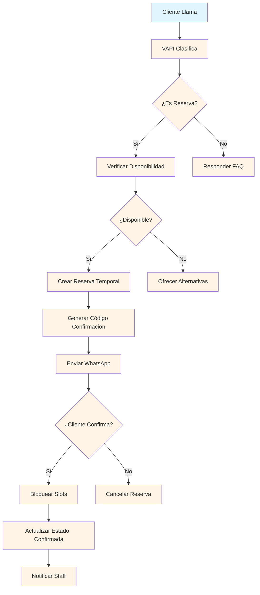
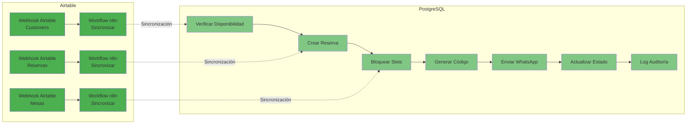

# Arquitectura del Modelo de Datos - En Las Nubes Restobar

## Descripción
Este documento describe la arquitectura del modelo de datos para el sistema de reservas de En Las Nubes Restobar, incluyendo el diagrama entidad-relación (ER) y las relaciones entre tablas.

## Diagrama Entidad-Relación (ER)

```mermaid
erDiagram
    restaurants ||--o{ restaurant_id }||--o{ customers
    restaurants ||--o{ restaurant_id }||--o{ tables
    restaurants ||--o{ restaurant_id }||--o{ reservations }
    
    customers ||--o{ customer_id }||--o{ reservations }
    customers ||--o{ customer_id }||--o{ audit_log }
    
    tables ||--o{ table_id }||--o{ reservations }
    tables ||--o{ table_id }||--o{ availability_slots }
    
    reservations ||--o{ id }||--o{ availability_slots }
    reservations ||--o{ id }||--o{ audit_log }
    
    availability_slots ||--o{ id }||--o{ audit_log }
    
    restaurant_info ||--o{ key }||--o{ restaurants }
    
    audit_log ||--o{ restaurant_id }||--o{ restaurants }
```

## Descripción de Tablas

### 1. Tabla: restaurants
**Propósito**: Almacenar información del restaurante, preparado para soporte multi-tenant futuro.

**Campos principales**:
- `restaurant_id` (UUID, PK): Identificador único
- `name`: Nombre del restaurante
- `address`, `phone`, `email`: Información de contacto
- `hours_config` (JSONB): Horarios de apertura por día
- `turn_config` (JSONB): Configuración de turnos (almuerzo/cena)
- `restrictions` (JSONB): Políticas de negocio (mascotas, gluten, etc.)

**Relaciones**:
- Uno a muchos con `customers`
- Uno a muchos con `tables`
- Uno a muchos con `reservations`
- Uno a muchos con `audit_log`

---

### 2. Tabla: customers
**Propósito**: CRM de clientes, historial de visitas y preferencias.

**Campos principales**:
- `customer_id` (UUID, PK): Identificador único
- `restaurant_id` (UUID, FK): Referencia al restaurante
- `name`, `phone`, `whatsapp`, `email`: Datos de contacto
- `preferences` (JSONB): Preferencias (zona, alergias, ocasiones especiales)
- `total_reservations`, `loyalty_points`, `last_visit_date`: Métricas de lealtad

**Relaciones**:
- Muchos a uno con `restaurants`
- Uno a muchos con `reservations`
- Uno a muchos con `audit_log`

**Notas**:
- `phone` es UNIQUE para evitar duplicados
- `restaurant_id` es nullable para permitir clientes sin restaurante específico

---

### 3. Tabla: tables
**Propósito**: Inventario físico de mesas (21 mesas en total).

**Campos principales**:
- `table_id` (VARCHAR(10), PK): Identificador (ej: 'A1', 'B2', 'C2-C')
- `restaurant_id` (UUID, FK): Referencia al restaurante
- `capacity_min`, `capacity_max`: Rango de capacidad
- `zone` (ENUM): Zona (interior/terraza)
- `notes`: Notas de ubicación (ej: 'JUNTO AL BAÑO')
- `is_auxiliary`: Para mesas auxiliares/combinables
- `priority`: Orden de asignación
- `coordinates_x`, `coordinates_y`: Posición física
- `features` (JSONB): Características (sillas niño, accesibilidad, etc.)

**Relaciones**:
- Muchos a uno con `restaurants`
- Uno a muchos con `reservations`
- Uno a muchos con `availability_slots`

**Notas**:
- `table_id` es VARCHAR para permitir identificadores como 'C2-C' (mesas combinables)
- `is_auxiliary` marca mesas que se combinan para grupos grandes

---

### 4. Tabla: reservations
**Propósito**: Registro de reservas y tracking de estados.

**Campos principales**:
- `id` (UUID, PK): Identificador único
- `restaurant_id` (UUID, FK): Referencia al restaurante
- `customer_id` (UUID, FK): Referencia al cliente
- `table_id` (VARCHAR(10), FK): Referencia a mesa
- `customer_name`, `customer_phone`: Redundancia para queries rápidas
- `guest_count`: Número de personas (PAX)
- `service_date`, `service_time`: Fecha y hora de servicio
- `status` (ENUM): Estado (pendiente/confirmada/cancelada/no_show/completada)
- `confirmation_code` (VARCHAR(8)): Código único de confirmación
- `confirmation_sent_at`, `confirmed_at`: Tracking de confirmación
- `special_requests` (JSONB): Solicitudes especiales (trona, descorche, etc.)
- `source`: Origen (VAPI/manual/web/whatsapp)
- `created_by`, `origin_system`: Auditoría de creación

**Relaciones**:
- Muchos a uno con `restaurants`
- Muchos a uno con `customers`
- Muchos a uno con `tables`
- Uno a muchos con `availability_slots`
- Uno a muchos con `audit_log`

**Notas**:
- `customer_name` y `customer_phone` son redundantes pero necesarios para queries rápidas sin JOIN
- `confirmation_code` es UNIQUE para evitar colisiones

---

### 5. Tabla: availability_slots
**Propósito**: Control granular de disponibilidad por mesa, fecha y hora.

**Campos principales**:
- `id` (UUID, PK): Identificador único
- `table_id` (VARCHAR(10), FK): Referencia a mesa
- `service_date`, `service_time`: Fecha y hora del slot
- `available` (BOOLEAN): Estado de disponibilidad
- `locked_by_reservation_id` (UUID, FK): Reserva que bloquea el slot

**Relaciones**:
- Muchos a uno con `tables`
- Muchos a uno con `reservations`
- Uno a muchos con `audit_log`

**Notas**:
- La combinación única `(table_id, service_date, service_time)` evita duplicados
- `locked_by_reservation_id` es nullable para slots disponibles

---

### 6. Tabla: audit_log
**Propósito**: Trazabilidad completa de todas las acciones en el sistema.

**Campos principales**:
- `id` (UUID, PK): Identificador único
- `restaurant_id` (UUID, FK): Referencia al restaurante
- `entity_type` (ENUM): Tipo de entidad (reservation/table/slot/customer)
- `entity_id` (UUID): ID de la entidad afectada
- `action` (ENUM): Acción realizada (create/confirm/cancel/lock/unlock/update/delete)
- `details` (JSONB): Detalles adicionales
- `old_values`, `new_values` (JSONB): Estado antes/después del cambio
- `performed_by` (VARCHAR(50)): Realizado por (system/staff/customer)
- `ip_address`, `user_agent`: Metadata de origen
- `system_source` (VARCHAR(20)): Sistema fuente (n8n)
- `workflow_id` (VARCHAR(50)): ID del workflow n8n
- `created_at` (TIMESTAMP): Fecha de creación

**Relaciones**:
- Muchos a uno con `restaurants`
- Muchos a uno con `customers`
- Muchos a uno con `reservations`
- Muchos a uno con `tables`
- Muchos a uno con `availability_slots`

**Notas**:
- `entity_id` es nullable para acciones globales sin entidad específica
- Los campos JSONB permiten almacenar cualquier estructura de datos

---

### 7. Tabla: restaurant_info
**Propósito**: Configuración global del restaurante (horarios, políticas).

**Campos principales**:
- `key` (VARCHAR(50), PK): Clave única
- `value` (TEXT): Valor de la configuración
- `value_type` (VARCHAR(20)): Tipo (text/json/number/boolean)
- `description` (TEXT): Descripción del campo
- `updated_at` (TIMESTAMP): Fecha de actualización

**Relaciones**:
- Sin relaciones directas (tabla de configuración)

**Notas**:
- Ejemplos de claves: `phone_number`, `address`, `opening_hours`, `max_reservation_days`
- Permite configuración flexible sin modificar esquema

---

## Relaciones Entre Tablas

### Relaciones de Foreign Key

| Tabla Hija | Campo FK | Tabla Padre | Campo PK | Acción ON DELETE |
|---------------|-----------|---------------|----------|-------------------|
| customers | restaurant_id | restaurants | restaurant_id | CASCADE |
| tables | restaurant_id | restaurants | restaurant_id | CASCADE |
| reservations | restaurant_id | restaurants | restaurant_id | CASCADE |
| reservations | customer_id | customers | customer_id | SET NULL |
| reservations | table_id | tables | table_id | SET NULL |
| availability_slots | table_id | tables | table_id | CASCADE |
| availability_slots | locked_by_reservation_id | reservations | id | SET NULL |
| audit_log | restaurant_id | restaurants | restaurant_id | CASCADE |

**Notas sobre acciones ON DELETE**:
- `CASCADE`: Elimina registros relacionados automáticamente
- `SET NULL`: Mantiene el registro pero elimina la referencia
- `SET NULL` se usa en `reservations.customer_id` y `reservations.table_id` para preservar el historial

---

## Índices y Optimización

### Índices Críticos para Rendimiento

#### Para queries de disponibilidad (más frecuentes)
```sql
-- Verificar disponibilidad por fecha y hora
CREATE INDEX idx_reservations_date_time ON reservations(service_date, service_time);
CREATE INDEX idx_availability_table_date ON availability_slots(table_id, service_date);
CREATE INDEX idx_availability_available ON availability_slots(available);
```

#### Para queries de cliente
```sql
-- Búsqueda por teléfono (muy frecuente)
CREATE INDEX idx_customers_phone ON customers(phone);
CREATE INDEX idx_reservations_phone ON reservations(customer_phone);
```

#### Para queries de estado
```sql
-- Filtrar por estado de reserva
CREATE INDEX idx_reservations_status ON reservations(status);
```

#### Para queries de auditoría
```sql
-- Logs ordenados por fecha (recientes primero)
CREATE INDEX idx_audit_timestamp ON audit_log(created_at DESC);
CREATE INDEX idx_audit_entity ON audit_log(entity_type, entity_id);
```

#### Para queries de zona y capacidad
```sql
-- Mesas por zona y capacidad
CREATE INDEX idx_tables_zone_capacity ON tables(zone, capacity_max);
CREATE INDEX idx_tables_priority ON tables(priority DESC);
```

---

## Vistas Útiles

### Vista: daily_availability
**Propósito**: Resumen de disponibilidad diaria por zona.

**Campos**:
- `restaurant_id`: ID del restaurante
- `service_date`: Fecha de servicio
- `zone`: Zona (interior/terraza)
- `mesas_disponibles`: Conteo de mesas disponibles
- `mesas_ocupadas`: Conteo de mesas ocupadas
- `capacidad_disponible`: Suma de capacidad de mesas disponibles
- `capacidad_ocupada`: Suma de capacidad de mesas ocupadas

**Query base**:
```sql
SELECT 
    r.restaurant_id,
    r.service_date,
    t.zone,
    COUNT(CASE WHEN a.available = true THEN 1 END) as mesas_disponibles,
    COUNT(CASE WHEN a.available = false THEN 1 END) as mesas_ocupadas,
    SUM(CASE WHEN a.available = true THEN t.capacity_max ELSE 0 END) as capacidad_disponible,
    SUM(CASE WHEN a.available = false THEN t.capacity_max ELSE 0 END) as capacidad_ocupada
FROM reservations r
CROSS JOIN tables t ON r.restaurant_id = t.restaurant_id
LEFT JOIN availability_slots a ON t.table_id = a.table_id AND a.service_date = r.service_date
WHERE t.is_active = true
GROUP BY r.restaurant_id, r.service_date, t.zone;
```

### Vista: customer_reservation_summary
**Propósito**: Resumen de historial de reservas por cliente.

**Campos**:
- `customer_id`: ID del cliente
- `name`, `phone`, `whatsapp`: Datos de contacto
- `total_reservas`: Total de reservas
- `reservas_confirmadas`: Reservas confirmadas
- `reservas_canceladas`: Reservas canceladas
- `ultima_visita`: Fecha de última visita
- `total_personas`: Suma total de personas

**Query base**:
```sql
SELECT 
    c.customer_id,
    c.name,
    c.phone,
    c.whatsapp,
    COUNT(r.id) as total_reservas,
    COUNT(CASE WHEN r.status = 'confirmada' THEN 1 END) as reservas_confirmadas,
    COUNT(CASE WHEN r.status = 'cancelada' THEN 1 END) as reservas_canceladas,
    MAX(r.service_date) as ultima_visita,
    SUM(r.guest_count) as total_personas
FROM customers c
LEFT JOIN reservations r ON c.customer_id = r.customer_id
GROUP BY c.customer_id, c.name, c.phone, c.whatsapp;
```

---

## Funciones Útiles

### Función: verificar_disponibilidad()
**Propósito**: Verificar disponibilidad de mesas según parámetros.

**Parámetros**:
- `p_restaurant_id` (UUID): ID del restaurante
- `p_fecha` (DATE): Fecha de servicio
- `p_hora` (TIME): Hora de servicio
- `p_num_personas` (INTEGER): Número de personas
- `p_zona` (ENUM, opcional): Zona preferida

**Retorno**: JSON con:
- `disponible`: Boolean
- `mesas_disponibles`: Conteo
- `capacidad_total`: Capacidad total del restaurante

**Lógica**:
1. Filtra mesas activas por restaurante
2. Filtra por zona si se especifica
3. Busca slots disponibles en la fecha y hora
4. Verifica capacidad mínima
5. Excluye mesas con reservas cercanas (dentro de 1 hora)

---

### Función: generar_codigo_confirmacion()
**Propósito**: Generar códigos de confirmación únicos.

**Retorno**: VARCHAR(8) con formato: 4 letras + 4 números

**Lógica**:
1. Genera código aleatorio usando MD5 de random()
2. Verifica unicidad en tabla `reservations`
3. Repite si ya existe el código

---

### Función: update_timestamp()
**Propósito**: Actualizar automáticamente el campo `updated_at`.

**Uso**: Trigger en todas las tablas con `updated_at`.

---

## Triggers

### Trigger Automático: updated_at
**Propósito**: Actualizar el campo `updated_at` automáticamente en cualquier UPDATE.

**Tablas afectadas**:
- `restaurants`
- `customers`
- `tables`
- `reservations`
- `restaurant_info`

**Implementación**:
```sql
CREATE TRIGGER trigger_[tabla]_updated
    BEFORE UPDATE ON [tabla]
    FOR EACH ROW EXECUTE FUNCTION update_timestamp();
```

---

## Flujo de Datos en el Sistema

### Flujo de Creación de Reserva



### Flujo de Sincronización Airtable ↔ PostgreSQL



---

## Consideraciones de Escalabilidad

### Multi-Tenant Futuro
El esquema está preparado para soportar múltiples restaurantes:

1. **`restaurant_id` en todas las tablas**: Permite filtrar por restaurante
2. **FKs con CASCADE**: Elimina automáticamente datos de restaurantes eliminados
3. **Índices por `restaurant_id`**: Queries eficientes por restaurante

### Partitioning (Futuro)
Para tablas grandes como `reservations` y `availability_slots`:

```sql
-- Partitioning por mes
CREATE TABLE reservations (
    -- ... campos ...
) PARTITION BY RANGE (service_date);

-- Crear particiones automáticamente
CREATE TABLE reservations_2025_01 PARTITION OF reservations
    FOR VALUES FROM ('2025-01-01') TO ('2025-02-01');
```

### Replicación (Futuro)
Para alta disponibilidad:

1. **Master-Slave**: PostgreSQL con replicación asíncrona
2. **Read Replicas**: Airtable lee de réplicas de lectura
3. **Write Master**: n8n escribe en master principal

---

## Seguridad y Restricciones

### Constraints de Integridad

#### UNIQUE Constraints
```sql
-- Teléfono de cliente único
CONSTRAINT unique_customer_phone UNIQUE(phone)

-- Código de confirmación único
CONSTRAINT reservations_confirmation_code_key UNIQUE(confirmation_code)

-- Slot único por mesa, fecha y hora
CONSTRAINT unique_table_slot UNIQUE(table_id, service_date, service_time)

-- Mesa única por restaurante
CONSTRAINT unique_restaurant_table UNIQUE(restaurant_id, table_id)
```

#### CHECK Constraints
```sql
-- Capacidad mínima positiva
CHECK (capacity_min > 0)

-- Capacidad máxima >= mínima
CHECK (capacity_max >= capacity_min)

-- Número de personas positivo
CHECK (guest_count > 0)

-- Valores válidos para ENUMs
CHECK (zone IN ('interior', 'terraza'))
CHECK (status IN ('pendiente', 'confirmada', 'cancelada', 'no_show', 'completada'))
CHECK (source IN ('VAPI', 'manual', 'web', 'whatsapp'))
CHECK (performed_by IN ('system', 'staff', 'customer'))
```

### Foreign Keys con CASCADE
```sql
-- Elimina automáticamente datos relacionados
REFERENCES restaurants(restaurant_id) ON DELETE CASCADE
REFERENCES customers(customer_id) ON DELETE SET NULL
REFERENCES tables(table_id) ON DELETE SET NULL
```

---

## Resumen de Arquitectura

### Características Clave

1. **Normalización**: Tercera forma normal (3NF) con tablas separadas
2. **Integridad Referencial**: FKs con CASCADE y SET NULL apropiados
3. **Flexibilidad**: JSONB para campos variables (preferences, special_requests, features)
4. **Trazabilidad**: `audit_log` registra todas las acciones
5. **Rendimiento**: Índices optimizados para queries frecuentes
6. **Escalabilidad**: Preparado para multi-tenant y partitioning
7. **Migración**: Diseñado para sincronización bidireccional con Airtable

### Soporte para Workflows n8n

El modelo de datos soporta directamente los workflows descritos en el PRD:

1. **CORE_CHECK_AVAILABILITY**: Usa `verificar_disponibilidad()` y consulta `availability_slots`
2. **CORE_CREATE_RESERVATION**: Inserta en `reservations`, crea en `customers` si no existe
3. **CORE_UPDATE_SLOTS**: Actualiza `availability_slots` (bloqueo/desbloqueo)
4. **CORE_GENERATE_CONFIRMATION_CODE**: Usa `generar_codigo_confirmacion()`
5. **CORE_ASSIGN_TABLE**: Actualiza `reservations.table_id`
6. **TWILIO_SEND_CONFIRMATION**: Lee `reservations` para enviar WhatsApp
7. **TWILIO_SEND_REMINDER**: Consulta `reservations` por fecha
8. **TWILIO_INBOUND_MESSAGE**: Actualiza `reservations.status` basado en respuesta WhatsApp

### Ventajas del Diseño

- **PostgreSQL como fuente de verdad**: Rendimiento, transacciones, integridad referencial
- **Airtable como dashboard**: Interfaz visual para staff, sincronizado en tiempo real
- **JSONB para flexibilidad**: Permite agregar campos sin modificar esquema
- **Audit_log completo**: Trazabilidad de todas las acciones para debugging
- **Índices optimizados**: Queries rápidas incluso con millones de registros
- **Preparado para multi-tenant**: `restaurant_id` en todas las tablas
- **Migración gradual**: Sincronización bidireccional sin interrumpir operación
